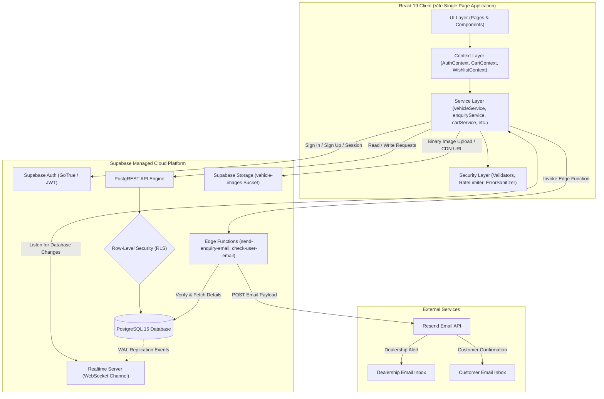
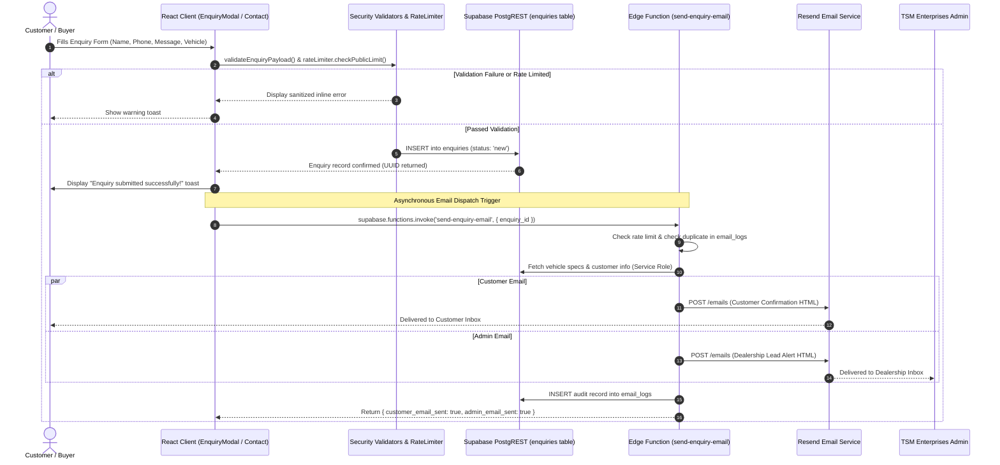
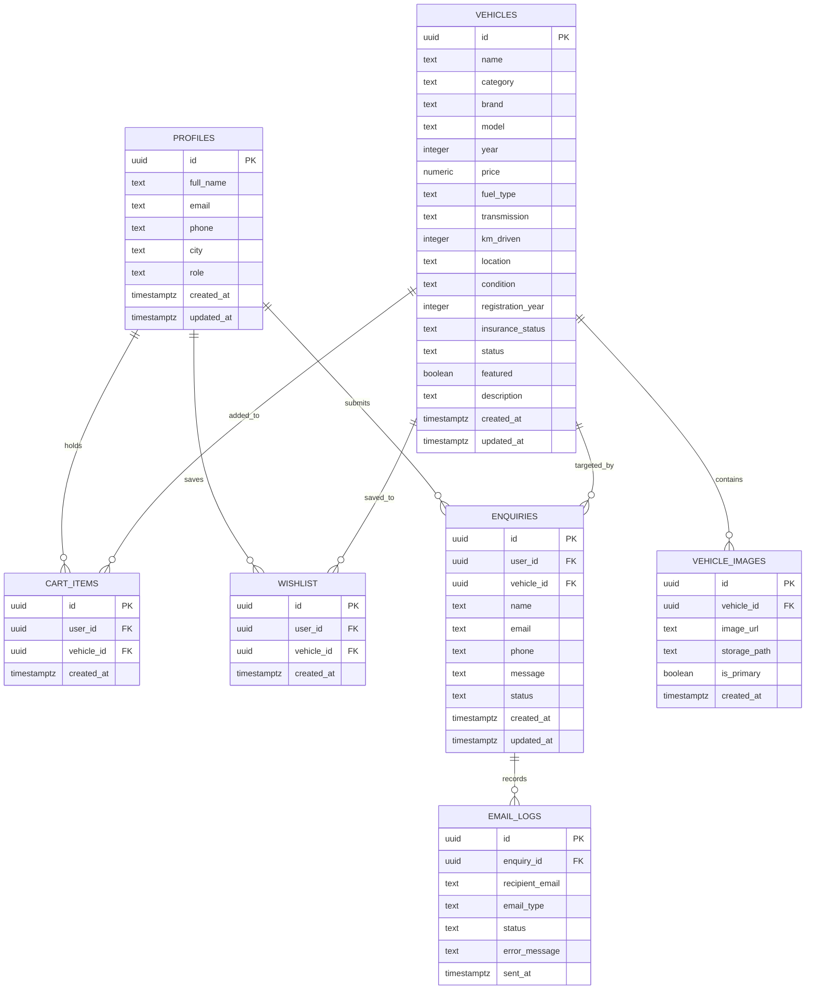
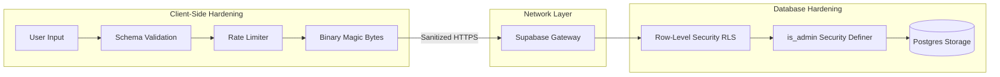
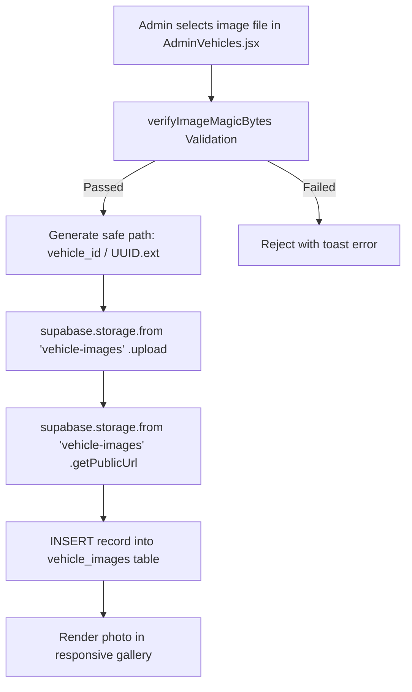
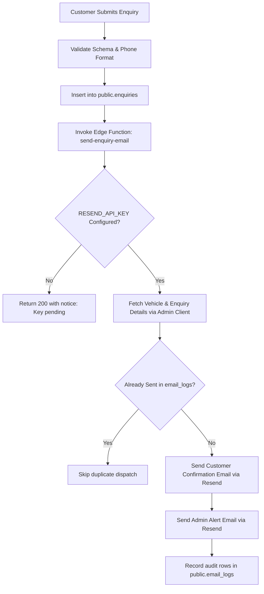
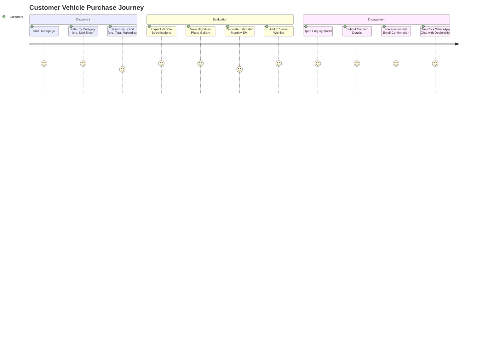

# TSM Enterprises — Second-Hand Vehicle Marketplace

> A production-grade commercial and agricultural second-hand vehicle marketplace and dealership management system engineered with React 19, Vite, Tailwind CSS, Supabase (Auth, PostgreSQL Database, Row-Level Security, Storage, Realtime, Edge Functions), and Resend API.

---

## Table of Contents

1. [Executive Summary & Business Overview](#1-executive-summary--business-overview)
2. [Key Highlights & Capabilities](#2-key-highlights--capabilities)
3. [Feature Matrix](#3-feature-matrix)
4. [Technology Stack](#4-technology-stack)
5. [System Architecture & Data Flows](#5-system-architecture--data-flows)
6. [Repository & Project Structure](#6-repository--project-structure)
7. [Database Architecture & Data Models](#7-database-architecture--data-models)
8. [Security Architecture & Defensive Hardening](#8-security-architecture--defensive-hardening)
9. [Authentication & Role-Based Access Control (RBAC)](#9-authentication--role-based-access-control-rbac)
10. [Supabase Storage & Media Asset Pipeline](#10-supabase-storage--media-asset-pipeline)
11. [PostgreSQL Realtime Synchronization](#11-postgresql-realtime-synchronization)
12. [Enquiry Engine & Supabase Edge Functions](#12-enquiry-engine--supabase-edge-functions)
13. [Vehicle Categories & Inventory Logic](#13-vehicle-categories--inventory-logic)
14. [Environment Configuration & Variables](#14-environment-configuration--variables)
15. [Local Development Setup & Installation](#15-local-development-setup--installation)
16. [Supabase Setup & Database Migration Guide](#16-supabase-setup--database-migration-guide)
17. [Dealership Operations & Admin Manual](#17-dealership-operations--admin-manual)
18. [Customer Journey & Experience](#18-customer-journey--experience)
19. [Troubleshooting & Common Pitfalls](#19-troubleshooting--common-pitfalls)
20. [Production Deployment Guide](#20-production-deployment-guide)
21. [Implementation Status & Roadmap](#21-implementation-status--roadmap)
22. [Dealership Contact & Support](#22-dealership-contact--support)

---

## 1. Executive Summary & Business Overview

**TSM Enterprises** is a commercial and agricultural second-hand vehicle dealership operating physically in Khunti, Jharkhand, India. The company specializes in sourcing, inspecting, refurbishing, and retailing dependable pre-owned utility vehicles, cargo autos, passenger autos, pickup trucks, mini-trucks, tractors, trailers, and commercial vans.

### Business Challenges Addressed
- **Information Transparency**: Second-hand commercial vehicle buyers frequently experience opaque pricing, unreliable vehicle mileage/spec records, and lack of clear inspection documents.
- **Direct Dealership Connect**: Eliminating intermediary commission agents by providing direct buyer-to-dealer enquiry routes via structured web forms, telephone, and WhatsApp integrations.
- **Inventory Turnaround**: Enabling the dealership management team to publish newly acquired vehicles, update operational statuses (`available` → `reserved` → `sold`), manage photo galleries, and track buyer enquiries in real time.

---

## 2. Key Highlights & Capabilities

- **Zero-Friction Customer Experience**: Prospective buyers can explore the entire inventory, filter across 9 specialized parameters, view photo galleries, compute on-road estimations, save to wishlist, and initiate purchasing enquiries without mandatory upfront login.
- **Role-Based Admin Console**: Authenticated dealership managers access a comprehensive back-office interface to manage vehicles, upload high-resolution photos directly to S3-compatible cloud storage, review customer inquiries, and trigger notifications.
- **Defense-in-Depth Security**: Strict Row-Level Security (RLS) enforcement at the database layer, binary magic-byte image validation before upload, path-traversal prevention, sliding-window client & edge rate-limiting, and error-message sanitization to prevent sensitive credential leakage.
- **Resilient Fallback Engine**: Seamless dual-mode architecture supporting live cloud connection via Supabase alongside offline/demo localStorage fallbacks when running without cloud environment variables.
- **Serverless Communications**: Automated dual-recipient email dispatch powered by a Supabase Edge Function (`send-enquiry-email`) using the `@supabase/server` SDK and Resend REST API, with complete delivery auditing stored in `email_logs`.

---

## 3. Feature Matrix

| Feature | Customer Portal | Admin Portal | Implementation Status |
| :--- | :---: | :---: | :---: |
| **Vehicle Inventory Browsing** | Multi-faceted filter & sorting | Complete inventory table & search | **Implemented** |
| **Realtime Inventory Sync** | Automatic inventory reload on change | Instant status & list updates | **Implemented** |
| **Vehicle Detail Showcase** | Full specs, gallery, EMI/Finance calculator | Direct edit & image management | **Implemented** |
| **Shopping Cart & Wishlist** | Persistent cloud cart & saved list | N/A (Audited via customer profiles) | **Implemented** |
| **Direct Vehicle Enquiry** | Modal & Contact form submission | Status progression (`new` to `completed`) | **Implemented** |
| **Direct Dealer Communication** | One-click Call & WhatsApp link | Direct outbound phone/WhatsApp actions | **Implemented** |
| **Email Notification Dispatch** | Branded customer confirmation HTML | Instant alert with full vehicle & user data | **Implemented** |
| **Email Delivery Auditing** | Confirmation status banner in form | Status tags, error logs, manual retry | **Implemented** |
| **Vehicle Image Uploads** | High-res responsive CDN viewing | Multi-file upload with binary validation | **Implemented** |
| **Customer Management** | Profile edit (Name, Phone, City) | Searchable registered customer ledger | **Implemented** |
| **Password Reset Flow** | Email verification & recovery page | Administrative role delegation | **Implemented** |
| **Inventory Statistics** | Category counts & stock badges | Real-time counts across vehicle statuses | **Implemented** |

---

## 4. Technology Stack

### Frontend Application
- **Library**: [React 19](https://react.dev/) (`19.2.8`) — Functional components, hooks, concurrent features.
- **Routing**: [React Router DOM v7](https://reactrouter.com/) (`7.18.3`) — Declarative client-side routing, protected routes (`AdminRoute`), scroll restoration.
- **Build Tool**: [Vite 8](https://vitejs.dev/) (`8.2.2`) — Lightning-fast ES modules, Rollup-based production bundling.
- **Styling**: [Tailwind CSS v3](https://tailwindcss.com/) (`3.4.19`) with PostCSS & Autoprefixer — Custom color system (`tsm-navy`, `tsm-red`), bespoke typography (`Syne` display font, `Inter` body font), shadow utilities.
- **UI Components & Icons**: [React Icons](https://react-icons.github.io/react-icons/) (`5.7.0`), [Headless UI](https://headlessui.com/) (`2.2.10`), [Swiper](https://swiperjs.com/) (`14.2.0`), [Framer Motion](https://www.framer.com/motion/) (`13.2.0`).
- **Feedback & Notifications**: [React Hot Toast](https://react-hot-toast.com/) (`2.6.0`) — Accessible, customizable toast notifications.
- **Linter & Code Quality**: [Oxlint](https://oxc.rs/) (`1.79.0`) — Ultra-fast Rust-based static analysis.

### Backend & Cloud Infrastructure (Supabase)
- **Database**: PostgreSQL 15+ hosted on [Supabase](https://supabase.com/).
- **Authentication**: Supabase Auth (GoTrue) utilizing JWT tokens, email/password verification, and session persistence.
- **Authorization**: PostgreSQL Row-Level Security (RLS) policies with declarative access control.
- **Blob Storage**: Supabase Storage (`vehicle-images` public bucket) backed by S3-compliant storage and global CDN.
- **Realtime Engine**: Supabase Realtime via PostgreSQL WAL replication over WebSockets (`supabase.channel`).
- **Serverless Functions**: Supabase Edge Functions built on the Deno runtime, orchestrating requests with `@supabase/server` (`1.5.2`).

### Communications & Integrations
- **Transactional Email**: [Resend API](https://resend.com/) — Modern developer email delivery service sending responsive HTML & plain-text templates.
- **Instant Messaging & Voice**: Direct tel-protocol links and WhatsApp Click-to-Chat URLs (`https://wa.me/917759054042`).

---

## 5. System Architecture & Data Flows

### High-Level Architecture Diagram



---

### End-to-End Customer Enquiry Flow



---

## 6. Repository & Project Structure

```text
tsm_client/
├── .agents/                               
│   └── skills/supabase-server/            
├── dist/                                 
├── public/                                
│   ├── favicon.ico                        
│   └── placeholder-vehicle.jpg            
├── src/
│   ├── assets/                            
│   │   └── tsm_logo.jpg                   
│   ├── components/                        
│   │   ├── AdminRoute.jsx                 
│   │   ├── CategoryCard.jsx               
│   │   ├── EnquiryModal.jsx               
│   │   ├── Footer.jsx                     
│   │   ├── Navbar.jsx                     
│   │   └── VehicleCard.jsx                
│   ├── config/                            
│   │   └── securityConfig.js              
│   ├── context/                           
│   │   ├── AuthContext.jsx                
│   │   ├── CartContext.jsx                
│   │   └── WishlistContext.jsx             
│   ├── data/                              
│   │   └── vehicles.js                    
│   ├── lib/                               
│   │   └── supabase.js                    
│   ├── pages/                             
│   │   ├── About.jsx                      
│   │   ├── Account.jsx                    
│   │   ├── Cart.jsx                       
│   │   ├── Contact.jsx                    
│   │   ├── ForgotPassword.jsx             
│   │   ├── Home.jsx                       
│   │   ├── Login.jsx                     
│   │   ├── NotFound.jsx                   
│   │   ├── ProductDetail.jsx              
│   │   ├── Products.jsx                   
│   │   ├── Register.jsx                  
│   │   ├── ResetPassword.jsx             
│   │   ├── Wishlist.jsx                   
│   │   └── admin/                        
│   │       ├── AdminCustomers.jsx         
│   │       ├── AdminDashboard.jsx         
│   │       ├── AdminEnquiries.jsx         
│   │       ├── AdminLayout.jsx            
│   │       └── AdminVehicles.jsx          
│   ├── services/                           
│   │   ├── cartService.js                 
│   │   ├── customerService.js             
│   │   ├── enquiryService.js              
│   │   ├── rateLimiter.js                 
│   │   ├── vehicleService.js              
│   │   └── wishlistService.js             
│   ├── utils/                             
│   │   ├── errorHandler.js                
│   │   └── securityValidators.js          
│   ├── App.jsx                           
│   ├── index.css                          
│   └── main.jsx                          
├── supabase/                              
│   └── functions/                         
│       ├── check-user-email/              
│       │   └── index.ts                   
│       └── send-enquiry-email/            
│           └── index.ts                   
├── .env.example                           
├── index.html                             
├── package.json                           
├── postcss.config.js                      
├── supabase_schema.sql                    
├── tailwind.config.js                     
└── vite.config.js                        
```

---

## 7. Database Architecture & Data Models

The database is built on PostgreSQL inside Supabase, enforcing strict schema typing, referential integrity via foreign key constraints, `ON DELETE CASCADE` rules, automated timestamps via triggers, and Row-Level Security (RLS) on every table.



### Table Definitions & Column Specifications

#### 1. `profiles`
Stores extended customer and administrative profile data, linked directly to `auth.users.id`.
- `id` (`uuid`, Primary Key, References `auth.users(id)` with `ON DELETE CASCADE`)
- `full_name` (`text`, Not Null)
- `email` (`text`, Unique, Not Null)
- `phone` (`text`, Optional contact number)
- `city` (`text`, Optional customer location)
- `role` (`text`, Check Constraint: `role IN ('customer', 'admin')`, Defaults to `'customer'`)
- `created_at` / `updated_at` (`timestamptz`, Automated via triggers)

#### 2. `vehicles`
The dealership's central inventory ledger.
- `id` (`uuid`, Primary Key, Defaults to `gen_random_uuid()`)
- `name` (`text`, Not Null, e.g. "Mahindra Bolero Maxi Truck Plus")
- `category` (`text`, Not Null, Check Constraint: `category IN ('cargo-auto', 'passenger-auto', 'electric-auto', 'tractor', 'mini-truck', 'pickup-truck', 'commercial-van', 'trailer', 'special-utility')`)
- `brand` (`text`, Not Null, e.g. "Mahindra", "Tata Motors", "Piaggio", "Bajaj")
- `model` (`text`, Optional model specification)
- `year` (`integer`, Not Null, Check: `year >= 1990 AND year <= 2030`)
- `price` (`numeric`, Not Null, Check: `price >= 0`)
- `fuel_type` (`text`, Check: `fuel_type IN ('Diesel', 'Petrol', 'CNG', 'Electric', 'LPG')`)
- `transmission` (`text`, Check: `transmission IN ('Manual', 'Automatic')`)
- `km_driven` (`integer`, Check: `km_driven >= 0`)
- `location` (`text`, Dealership yard branch, e.g. "Khunti, Jharkhand")
- `condition` (`text`, Check: `condition IN ('Excellent', 'Good', 'Fair')`)
- `registration_year` (`integer`)
- `insurance_status` (`text`, Check: `insurance_status IN ('Valid', 'Expired', 'Third-Party', 'Comprehensive')`)
- `status` (`text`, Check Constraint: `status IN ('available', 'reserved', 'sold')`, Defaults to `'available'`)
- `featured` (`boolean`, Defaults to `false`)
- `description` (`text`, Detailed vehicle notes)
- `created_at` / `updated_at` (`timestamptz`)

#### 3. `vehicle_images`
One-to-many relationship supporting multiple gallery photographs per vehicle.
- `id` (`uuid`, Primary Key, Defaults to `gen_random_uuid()`)
- `vehicle_id` (`uuid`, Foreign Key references `vehicles(id)` with `ON DELETE CASCADE`)
- `image_url` (`text`, Not Null, Public CDN URL)
- `storage_path` (`text`, Storage bucket relative path for object deletion)
- `is_primary` (`boolean`, Defaults to `false`, Marks the lead card thumbnail)
- `created_at` (`timestamptz`)

#### 4. `cart_items`
User-specific staging cart for purchasing enquiries.
- `id` (`uuid`, Primary Key)
- `user_id` (`uuid`, Foreign Key references `auth.users(id)` with `ON DELETE CASCADE`)
- `vehicle_id` (`uuid`, Foreign Key references `vehicles(id)` with `ON DELETE CASCADE`)
- `created_at` (`timestamptz`)
- *Unique Constraint*: `UNIQUE (user_id, vehicle_id)` ensures duplicate vehicles cannot be added.

#### 5. `wishlist`
User-specific saved vehicle bookmarking.
- `id` (`uuid`, Primary Key)
- `user_id` (`uuid`, Foreign Key references `auth.users(id)` with `ON DELETE CASCADE`)
- `vehicle_id` (`uuid`, Foreign Key references `vehicles(id)` with `ON DELETE CASCADE`)
- `created_at` (`timestamptz`)
- *Unique Constraint*: `UNIQUE (user_id, vehicle_id)` prevents duplicate bookmarks.

#### 6. `enquiries`
Core inbound sales leads table capturing buyer requests.
- `id` (`uuid`, Primary Key)
- `user_id` (`uuid`, Nullable Foreign Key references `auth.users(id)` with `ON DELETE SET NULL`)
- `vehicle_id` (`uuid`, Nullable Foreign Key references `vehicles(id)` with `ON DELETE SET NULL`)
- `name` (`text`, Not Null, Customer Name)
- `email` (`text`, Nullable, Customer Email)
- `phone` (`text`, Not Null, 10-digit Mobile Number)
- `message` (`text`, Customer comments, questions, or visit requests)
- `status` (`text`, Check: `status IN ('new', 'contacted', 'negotiating', 'completed', 'cancelled')`, Defaults to `'new'`)
- `created_at` / `updated_at` (`timestamptz`)

#### 7. `email_logs`
Delivery audit log recording transactional notifications dispatched for enquiries.
- `id` (`uuid`, Primary Key)
- `enquiry_id` (`uuid`, Foreign Key references `enquiries(id)` with `ON DELETE CASCADE`)
- `recipient_email` (`text`, Not Null)
- `email_type` (`text`, Check: `email_type IN ('customer_confirmation', 'admin_notification')`)
- `status` (`text`, Check: `status IN ('sent', 'failed', 'skipped')`)
- `error_message` (`text`, Nullable diagnostic error returned by email gateway)
- `sent_at` (`timestamptz`)

---

## 8. Security Architecture & Defensive Hardening

The application applies defense-in-depth principles across frontend inputs, backend API boundaries, and database storage:



### 1. Database-Level Row-Level Security (RLS)
Every table has RLS explicitly enabled (`ALTER TABLE ... ENABLE ROW LEVEL SECURITY`). The application defines a specialized PostgreSQL security function:
```sql
CREATE OR REPLACE FUNCTION public.is_admin()
RETURNS boolean
LANGUAGE sql
SECURITY DEFINER
STABLE
AS $$
  SELECT EXISTS (
    SELECT 1 FROM public.profiles
    WHERE id = auth.uid() AND role = 'admin'
  );
$$;
```
- **Vehicles**: Publicly readable by all (`anon` and `authenticated`). Modification (Insert, Update, Delete) is restricted strictly to users where `is_admin() = true`.
- **Enquiries**: Anonymous and registered customers can submit (`INSERT`) enquiries. Customers can read only their own enquiries (`user_id = auth.uid()`). Administrators have global read, update, and delete rights.
- **Profiles**: Users can read and update only their own profile (`id = auth.uid()`). Administrators can view all profiles in `AdminCustomers.jsx`.
- **Cart & Wishlist**: Restricted strictly to the owning user (`user_id = auth.uid()`).

### 2. Binary Magic-Byte File Validation
To prevent malicious scripts (e.g. disguised `.php` or `.html` payloads) from being uploaded, `src/utils/securityValidators.js` reads the file's raw binary header bytes via `FileReader`:
- **JPEG**: `0xFF, 0xD8, 0xFF`
- **PNG**: `0x89, 0x50, 0x4E, 0x47`
- **WebP**: `RIFF....WEBP` header format
Files failing header verification are rejected before network transmission.

### 3. Path Traversal & Storage Sanitization
When storing image assets, random UUIDs are assigned to filenames (`crypto.randomUUID()`), and directories are strictly constrained to verified UUID vehicle identifiers. Filenames are restricted to whitelisted image extensions (`.jpg`, `.png`, `.webp`).

### 4. Sliding-Window Rate Limiting
- **Client-Side** (`src/services/rateLimiter.js`): Enforces client limits with exponential backoff on login attempts (maximum 5 failed attempts before lockout), registrations, password resets, and enquiry submissions.
- **Edge Functions** (`supabase/functions/send-enquiry-email/index.ts`): Enforces IP-based sliding window limits (maximum 15 calls per minute per IP) and per-enquiry dispatch limits (maximum 3 dispatches per 5 minutes) to prevent email gateway exhaustion.

### 5. Error Message Sanitization
The utility `src/utils/errorHandler.js` intercepts all raw API errors before they reach the UI, masking database internals, table structures, connection strings, and system stack traces into safe, human-readable notices.

---

## 9. Authentication & Role-Based Access Control (RBAC)

Authentication is handled via Supabase Auth (GoTrue), backed by email/password credentials and persistent JWT tokens in browser `localStorage`.

### User Roles
1. **`customer`**:
   - Default role assigned upon registration.
   - Can view catalog, save items to cart/wishlist, submit vehicle enquiries, and edit personal profile info.
2. **`admin`**:
   - Authorized dealership management staff.
   - Access to `/admin/*` routes.
   - Allowed full inventory CRUD, customer ledger inspection, status modifications, and email log monitoring.

### Email Confirmation Flow
When `auth.signUp()` is called, Supabase sends a confirmation email. The application verifies whether `user.email_confirmed_at` is set. If the email is unconfirmed, the session is purged from memory, and the user is guided to confirm their address before login.

### Protected Admin Routes
The component `src/components/AdminRoute.jsx` wraps all admin page routes. It monitors `AuthContext`:
- If authentication is still loading: Displays a sleek loading animation.
- If user is not authenticated: Redirects to `/login` preserving the attempted path in location state.
- If authenticated user does not have `isAdmin`: Redirects to `/` with an unauthorized access warning toast.

---

## 10. Supabase Storage & Media Asset Pipeline

Vehicle photographs are stored in the dedicated Supabase Storage bucket: **`vehicle-images`**.



### Storage Security Policies
In `supabase_schema.sql`, storage objects in `vehicle-images` are secured via Storage RLS:
- **Public Read**: Anyone can read objects in `vehicle-images` (`bucket_id = 'vehicle-images'`).
- **Admin Upload/Modify/Delete**: Uploads, updates, and deletes require `is_admin() = true`.

---

## 11. PostgreSQL Realtime Synchronization

Realtime inventory updates are enabled via Supabase Realtime, which streams PostgreSQL Write-Ahead Log (WAL) changes directly to connected web clients over WebSockets.

### Implementation in `vehicleService.js`
```javascript
subscribeToChanges(callback) {
  if (!isSupabaseConfigured) return () => {}

  const channel = supabase
    .channel('public:vehicles')
    .on(
      'postgres_changes',
      {
        event: '*',           // Listens for INSERT, UPDATE, and DELETE
        schema: 'public',
        table: 'vehicles',
      },
      (payload) => {
        if (typeof callback === 'function') {
          callback(payload)
        }
      }
    )
    .subscribe()

  // Return cleanup function to unsubscribe on component unmount
  return () => {
    supabase.removeChannel(channel)
  }
}
```

### Component Consumption in `Products.jsx`
When the inventory catalog mounts, it attaches the listener. Any external change (e.g. an admin updating a vehicle's status to `sold` in another browser) triggers `fetchData()`, updating the customer's view without requiring a manual page refresh.

---

## 12. Enquiry Engine & Supabase Edge Functions

When a customer submits an enquiry, the system coordinates database storage with serverless email notifications:



### Edge Function: `send-enquiry-email`
Located in `supabase/functions/send-enquiry-email/index.ts`:
- Built with `@supabase/server` using `withSupabase({ auth: 'none' })`.
- Handles CORS preflight requests (`OPTIONS`).
- Utilizes `ctx.supabaseAdmin` to query vehicle specifications and enquiry details safely bypassing client RLS restrictions.
- Sends responsive, dealership-branded HTML emails to both customer and dealer via `https://api.resend.com/emails`.
- Inserts audit rows into `email_logs` with statuses `sent` or `failed`.

### Manual Email Retry in Admin Console
If an email fails to dispatch (e.g. transient gateway error or temporary DNS failure), the Admin Enquiries dashboard (`AdminEnquiries.jsx`) provides a **Retry Email** button. Clicking this triggers `enquiryService.retryEmail(enquiryId)`, which re-invokes the Edge Function and updates the delivery badge upon success.

---

## 13. Vehicle Categories & Inventory Logic

TSM Enterprises organizes commercial and agricultural utility vehicles into 9 specialized categories defined in `src/data/vehicles.js`:

| Category ID | Display Name | Typical Vehicles / Use Case |
| :--- | :--- | :--- |
| `cargo-auto` | **Cargo Auto** | Mahindra Alfa Plus, Piaggio Ape Xtra LDX, Bajaj Maxima C |
| `passenger-auto` | **Passenger Auto** | Bajaj Compact RE, Piaggio Ape City, Mahindra Treo |
| `electric-auto` | **Electric Auto** | Mahindra Treo Zor, Piaggio Ape E-City, Euler HiLoad |
| `mini-truck` | **Mini Truck** | Tata Ace Gold, Mahindra Supro, Ashok Leyland Dost |
| `pickup-truck` | **Pickup Truck** | Mahindra Bolero Maxi Truck, Isuzu D-Max, Tata Yodha |
| `tractor` | **Tractor** | Mahindra 575 DI, Swaraj 744 FE, John Deere 5050 D |
| `commercial-van` | **Commercial Van** | Maruti Suzuki Eeco Cargo, Tata Magic Express |
| `trailer` | **Trailer & Trolley** | Agricultural tipping trailers, commercial 2/4-wheel trollies |
| `special-utility` | **Special Utility** | Water tankers, municipal tipping hoppers, recovery vehicles |

### Inventory Status Progression
- **`available`**: Displayed with prominent green badge; eligible for addition to Cart, Wishlist, and active purchase enquiry.
- **`reserved`**: Displayed with yellow warning badge; customer token advance received; active enquiry open.
- **`sold`**: Displayed with red sold badge; blocked from addition to cart; marked as non-available.

---

## 14. Environment Configuration & Variables

Create a root-level `.env` file for local development:

```bash
cp .env.example .env
```

### Required Variables Specification

```ini
# ==============================================================================
# TSM ENTERPRISES — CLIENT ENVIRONMENT VARIABLES (.env)
# ==============================================================================

# Supabase Project API URL (From Supabase Dashboard -> Settings -> API)
VITE_SUPABASE_URL=https://YOUR_SUPABASE_PROJECT_ID.supabase.co

# Supabase Anonymous Public API Key (Safe to expose in browser bundle)
VITE_SUPABASE_ANON_KEY=YOUR_SUPABASE_ANON_PUBLIC_KEY

# Dealership Public Support & Communication Coordinates
VITE_CONTACT_PHONE=+91 77590 54042
VITE_CONTACT_EMAIL=kamikimnekaku@gmail.com
VITE_WHATSAPP_NUMBER=917759054042

# Optional Dealership Physical Coordinates
VITE_DEALERSHIP_ADDRESS="Near Govt Bus Stand, Gayatri Nagar, Khunti, Jharkhand, India"
```

### Supabase Edge Function Secrets (Cloud Configuration)
Set via Supabase CLI or Supabase Dashboard (**Project Settings -> Edge Functions -> Secrets**):

```bash
# Set secrets via Supabase CLI
supabase secrets set RESEND_API_KEY="re_YOUR_RESEND_API_KEY"
supabase secrets set ADMIN_EMAIL="admin@tsmenterprises.in"
supabase secrets set FROM_EMAIL="TSM Enterprises <onboarding@resend.dev>"
supabase secrets set SITE_URL="https://YOUR_PRODUCTION_DOMAIN.com"
```

---

## 15. Local Development Setup & Installation

### Prerequisites
- [Node.js](https://nodejs.org/) version 18.0.0 or higher.
- [npm](https://www.npmjs.com/) version 9.0.0 or higher.
- Git installed on your operating system.

### Step-by-Step Installation

1. **Clone the Repository**:
   ```bash
   git clone https://github.com/YOUR_ORGANIZATION/tsm_client.git
   cd tsm_client
   ```

2. **Install Dependencies**:
   ```bash
   npm install
   ```

3. **Configure Environment Variables**:
   Create your local `.env` file and input your credentials:
   ```bash
   cp .env.example .env
   ```

4. **Launch the Local Development Server**:
   ```bash
   npm run dev
   ```
   The local Vite server will start (default: `http://localhost:5173`).

5. **Execute Static Code Analysis (Linting)**:
   ```bash
   npm run lint
   ```

6. **Validate Production Build**:
   ```bash
   npm run build
   npm run preview
   ```

---

## 16. Supabase Setup & Database Migration Guide

Follow these steps to configure a brand new Supabase project for TSM Enterprises:

### 1. Initialize Database Schema
1. Log in to your [Supabase Dashboard](https://app.supabase.com/).
2. Create a new project named `tsm-enterprises`.
3. Navigate to **SQL Editor** in the left navigation sidebar.
4. Open the file `supabase_schema.sql` from this repository.
5. Paste the entire SQL script into the SQL Editor and click **Run**.
   - This creates all 7 tables, check constraints, foreign keys, triggers, security functions (`is_admin`), and RLS policies.

### 2. Configure Storage Bucket
1. Navigate to **Storage** in the Supabase Dashboard.
2. Confirm that the bucket **`vehicle-images`** exists. If not, create a **Public Bucket** named `vehicle-images`.
3. Verify that the RLS policies defined in `supabase_schema.sql` are active for `storage.objects`:
   - Public read access for all users.
   - Insert/Update/Delete access restricted to users with `role = 'admin'`.

### 3. Create the Administrator Account
1. Navigate to **Authentication -> Users** in the Supabase Dashboard.
2. Click **Add User** -> **Create User**, and enter the dealership administrator email and password.
3. Once created, copy the user's `UUID`.
4. Run the following query in the **SQL Editor** to grant administrative privileges:
   ```sql
   INSERT INTO public.profiles (id, full_name, email, phone, city, role)
   VALUES (
     'PASTE_USER_UUID_HERE',
     'TSM Administrator',
     'admin@tsmenterprises.in',
     '+91 77590 54042',
     'Khunti, Jharkhand',
     'admin'
   )
   ON CONFLICT (id) DO UPDATE SET role = 'admin';
   ```

### 4. Deploy Supabase Edge Functions
Using the Supabase CLI:
```bash
# Login to Supabase CLI
supabase login

# Link your local repo to your remote project
supabase link --project-ref YOUR_SUPABASE_PROJECT_ID

# Set Edge Function secrets
supabase secrets set RESEND_API_KEY="YOUR_RESEND_API_KEY"
supabase secrets set ADMIN_EMAIL="YOUR_DEALER_EMAIL@DOMAIN.COM"

# Deploy functions
supabase functions deploy send-enquiry-email --no-verify-jwt
supabase functions deploy check-user-email --no-verify-jwt
```

---

## 17. Dealership Operations & Admin Manual

### 1. Admin Login Access
- Navigate to `/login` in your web browser.
- Enter your registered dealership administrator credentials.
- Upon successful authentication, the top navigation displays the **Admin** dashboard link (`/admin/dashboard`).

### 2. Inventory Management (`/admin/vehicles`)
- **Adding a Vehicle**: Click the **Add Vehicle** button. Complete the modal form with vehicle title, category, brand, manufacturing year, price (INR), mileage (km driven), fuel type, transmission, condition, and location.
- **Uploading Vehicle Images**: Use the file input in the vehicle form to upload images directly from your computer. The system validates the images, uploads them to the `vehicle-images` cloud bucket, and attaches the public URLs.
- **Updating Vehicle Status**: Use the table dropdown to transition a vehicle between `available`, `reserved`, and `sold`. The change updates the database immediately and streams via Realtime to all connected customer browsers.
- **Editing & Deleting**: Click the pencil icon to modify vehicle specs, or click the trash icon to permanently remove an inventory item (cascading image references automatically).

### 3. Lead & Enquiry Management (`/admin/enquiries`)
- View all buyer enquiries sorted chronologically.
- Filter enquiries by status (`new`, `contacted`, `negotiating`, `completed`, `cancelled`).
- Review direct customer notes and target vehicle interest.
- Click the phone or WhatsApp icons to initiate immediate outbound customer contact.
- Monitor email delivery badges (`Customer Email: sent / failed`, `Admin Email: sent / failed`). Use the **Retry Email** button if a transmission failed.

### 4. Registered Customers Ledger (`/admin/customers`)
- Search registered users by name, email, phone number, or city.
- Inspect customer registration dates and profile completeness.

---

## 18. Customer Journey & Experience



---

## 19. Troubleshooting & Common Pitfalls

### 1. "Row-Level Security Policy Violation" on Cart or Wishlist Insert
- **Symptom**: Console logs error `42501: new row violates row-level security policy for table "cart_items"`.
- **Cause**: User is attempting to add items while unauthenticated, or the `auth.uid()` does not match `user_id`.
- **Mitigation**: The application includes automatic fallback to `localStorage` when RLS blocks insertion in development. For production, ensure the user is logged in before database sync.

### 2. Image Upload Fails with "Invalid or untrusted image file"
- **Symptom**: Toast error when attempting to upload vehicle photos in Admin portal.
- **Cause**: The file failed binary magic-byte validation (e.g. corrupt header, unsupported TIFF or SVG format).
- **Mitigation**: Convert the image to standard JPEG, PNG, or WebP format before uploading.

### 3. Emails Not Dispatched (Status Stays "Pending")
- **Symptom**: Enquiry is saved in database, but customer or admin receives no email.
- **Cause**: `RESEND_API_KEY` is missing in Supabase Edge Function secrets.
- **Mitigation**: Run `supabase secrets set RESEND_API_KEY="re_..."` or configure it in Supabase Dashboard (**Edge Functions -> Secrets**).

### 4. Vehicle Changes Do Not Stream in Realtime
- **Symptom**: Customer browser does not update when an admin updates vehicle status.
- **Cause**: The `vehicles` table is not added to the `supabase_realtime` publication.
- **Mitigation**: Run the following SQL command in Supabase SQL Editor:
  ```sql
  ALTER PUBLICATION supabase_realtime ADD TABLE public.vehicles;
  ```

---

## 20. Production Deployment Guide

### Building for Production
```bash
npm run build
```
This generates the optimized production bundle in `/dist` (`index.html`, minified JavaScript chunks, and compiled CSS).

### Recommended Hosting Providers
- **Vercel**: Deploy directly from Git. Ensure build command is `npm run build` and output directory is `dist`. Add a `vercel.json` for SPA routing:
  ```json
  {
    "rewrites": [{ "source": "/(.*)", "destination": "/index.html" }]
  }
  ```
- **Netlify**: Set build command to `npm run build` and publish directory to `dist`. Add a `_redirects` file:
  ```text
  /*    /index.html   200
  ```

---

## 21. Implementation Status & Roadmap

| Module | Sub-Feature | Implementation Status |
| :--- | :--- | :---: |
| **Catalog & Search** | Full Multi-Parameter Filtering (Price, Brand, Fuel, Category) | **Implemented** |
| | PostgreSQL Realtime Inventory Sync | **Implemented** |
| | Category Count Computation | **Implemented** |
| **User Experience** | Shopping Cart (Cloud Database & LocalStorage Fallback) | **Implemented** |
| | Saved Wishlist (Cloud Database & LocalStorage Fallback) | **Implemented** |
| | Vehicle Financial EMI Estimator Calculator | **Implemented** |
| **Enquiry & Communications** | Multi-channel Enquiry Form with Rate Limiting | **Implemented** |
| | Supabase Edge Function Email Engine with Resend API | **Implemented** |
| | Dealership WhatsApp & Call Integration | **Implemented** |
| | Delivery Audit Logging & Admin Retry Action | **Implemented** |
| **Authentication & RBAC** | Supabase Auth with Email Confirmation | **Implemented** |
| | Role-Based Admin Guard (`AdminRoute`) | **Implemented** |
| | Password Reset & Token Verification Flow | **Implemented** |
| **Dealership Back-Office** | Realtime Admin Dashboard with Metrics | **Implemented** |
| | Vehicle CRUD with S3/Supabase Storage Integration | **Implemented** |
| | Binary Magic-Byte Image File Security Check | **Implemented** |
| | Customer Database Ledger | **Implemented** |
| | Lead Management & Status Progression | **Implemented** |
| **Future Capabilities** | Automated SMS Gateway (Twilio / Gupshup) for instant SMS alerts | **Planned** |
| | Direct Customer Online Token Payment Gateway (Razorpay) | **Planned** |
| | Vehicle Inspection PDF Generation & Download | **In Progress** |

---

## 22. Dealership Contact & Support

For vehicle inquiries, dealership visits, or technical questions regarding this application, contact **TSM Enterprises**:

- **Dealership Name**: TSM Enterprises
- **Specialization**: Quality Pre-Owned Commercial & Agricultural Vehicles
- **Physical Address**: Near Govt Bus Stand, Gayatri Nagar, Khunti, Jharkhand, India
- **Phone / WhatsApp**: [+91 77590 54042](tel:+917759054042)
- **WhatsApp Chat**: [Chat on WhatsApp](https://wa.me/917759054042?text=Hi%20TSM%20Enterprises!%20I'm%20interested%20in%20your%20vehicles.)
- **Primary Dealership Email**: [kamikimnekaku@gmail.com](mailto:kamikimnekaku@gmail.com)
- **Business Hours**:
  - **Monday – Saturday**: 9:00 AM – 7:00 PM IST
  - **Sunday**: 10:00 AM – 4:00 PM IST

---

*Copyright &copy; 2026 TSM Enterprises. All Rights Reserved.*
